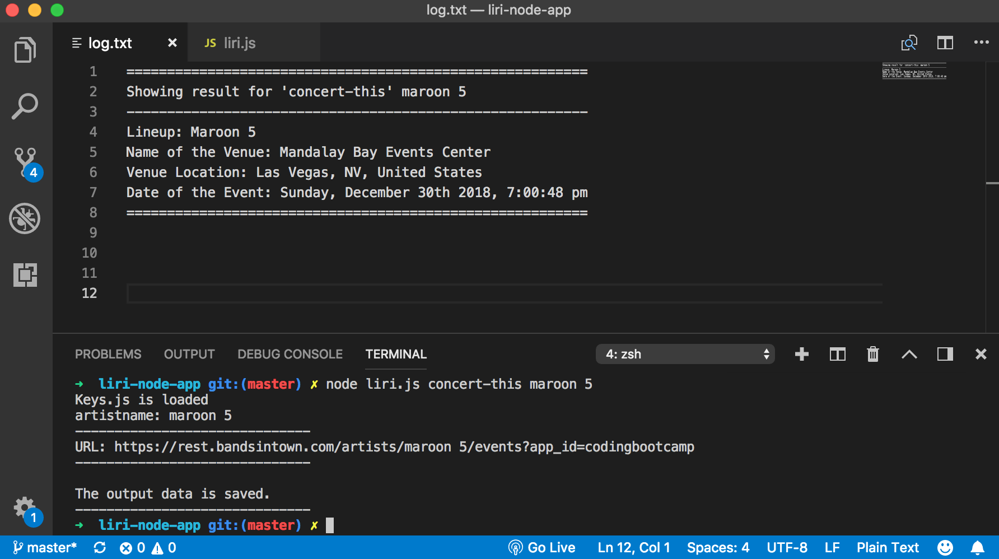

# LIRI Node Application

An interactive Node-based command-line (**CLI**) application that takes in parameters and gives you back data. 

### What is LIRI?
LIRI is like iPhone's SIRI. However, while SIRI is a Speech Interpretation and Recognition Interface, LIRI is a **L**anguage **I**nterpretation and **R**ecognition **I**nterface. 

---
## How This App Works

In this app, LIRI will search Spotify for songs, Bands in Town for concerts, and OMDB for movies. LIRI will take these four commands: `concert-this`, `spotify-this-song`, `movie-this`, and `do-what-it-says`. 

(https://drive.google.com/file/d/1tJOyA7SNRl9KHkF4FVhXiwSvx8zKsZaN/view)
[Click to Play](https://keenwilson.github.io/RPS-Multiplayer/ "Rock-Paper-Scissors Multiplayer")
* The `node liri.js concert-this '<artist/band name here>'` command will search the Bands in Town Artist Events API for an artist and render the following information about each event to your terminal/bash window:
    * Name of the venue
    * Venue location
    * Date of the Event (use `moment` to format this as "MM/DD/YYYY")

* The `node liri.js spotify-this-song '<song name here>'` command will output the following information about the song in your terminal/bash window:
    * Artist(s)
    * The song's name
    * A preview link of the song from Spotify
    * The album that the song is from
    
If no song is provided then your program will default to "The Sign" by Ace of Base.
  

* The `node liri.js movie-this '<movie name here>'` command will search the [OMDb API](http://www.omdbapi.com/) for a movie and show the following information to your terminal/bash window:
     * Title of the movie
    * Year the movie came out.
    * IMDB Rating of the movie
    * Rotten Tomatoes Rating of the movie
    * Country where the movie was produced
    * Language of the movie
    * Plot of the movie
    * Actors in the movie
    
If the user doesn't type a movie in, the program will output data for the movie 'Mr. Nobody.'

* The `node liri.js do-what-it-says` command will take the text inside of random.txt and then use it to call one of LIRI's commands. 

---
## Technical Approach
* Run `npm init -y`  to initialize a `package.json` file for your project. The package.json file is required for installing third party npm packages and saving their version numbers. If you fail to initialize a package.json file, it will be troublesome, and at times almost impossible for anyone else to run your code after cloning your project.
* Make a `.gitignore` file and add `node_modules`, `.DS_Store`, `.env` to it. This will tell git not to track these files, and thus they won't be committed to Github.
* Use these node packages to retrieve the data that will power this app
    * `Node-Spotify-Api`
    * `Request`
    * `Moment`
    * `DotEnv`
* Create `.env` file to be used by the `DotEnv` package to set what are known as environment variables to the global `process.env` object in node. These are values that are meant to be specific to the computer that node is running on, and since we are `.gitignoring` this file, they won't be pushed to github — keeping our API key information private. If someone wanted to clone this app from github and run it themselves, they would need to supply their own `.env` file for it to work.
    
---
## Author

[Keen Wilson](https://keenwilson.github.io/ "Keen Wilson's Portfolio")
